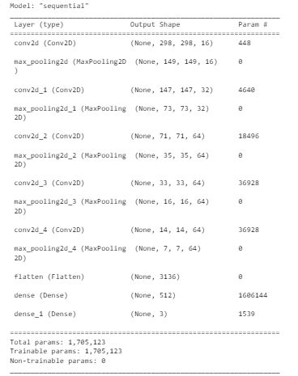

# Jamuin-ML
# Introduction

Team ID:C23-PS445 
 

## Contributors

| Name                           | Specialization     | Role                           | Profile                               |
| -------------------------------| ------------------ | -------------------------------| --------------------------------------|
| Yohanes Egi Pratama Yudoutomo  | Machine Learning   | ML Engineer                    | [Github](https://github.com/hanesegi) |
| Dian Alhusari                  | Machine Learning   | ML Engineer                    | [Github](https://github.com/alhusari2)|
| Muhammad Faishal Azhar Suherman| Cloud Computing    | Cloud Engineer (ML Deployment) | [Github](https://github.com/Faishal25)| 

# Model Description:
a machine learning model was created to classify images of herbal ingredients that we often encounter to be recommended into herbal products, including:

## Built with
- [Python](https://www.python.org/ "Python")
- [TensorFlow](https://www.tensorflow.org/ "TensorFlow")
- [Flask](https://flask.palletsprojects.com/en/2.1.x/ "Flask")
- [Google Cloud Run](https://cloud.google.com/run)
- [Google Colab](https://colab.research.google.com/ "Google Colab")

# Dataset:
dataset of herbal ingredients obtained by scraping, and manually [data](https://drive.google.com/drive/folders/1KDyy5kXO6M25G-KQ7x3pyj171u4ZTk81?usp=drive_link)

Preview of the image and data used are shown in the picture below:

<h5>Kunyit</h5>

     
# Arsitektur Model
Arsitektur Model

# Make RESTfull API with Flask and Cloud Run
1. Prepare prediction model in "<b>h.5</b>" format, file are stored in "ML-Backend" folder 
2. Write <b>main.py</b> base on machine learning testing model, files are saved in the "ML-Backend" folder
3. Create file named "<b>requirement.txt</b>" for library you need for running our code
4. Create file named "<b>Dockerfile</b>" for run system in our container
5. Create file named "<b>.dockerignore</b>" for ignore system to ignore spesific file.
6. Create folder static/uploads to save photos for prediction progress.
7. Create new Project in <b>Google Cloud Platform</b>
8. Active <b>Cloud Run API</b> and <b>Cloud Build API</b>
9. Install and init Google Cloud SDK (Use this link : <b>https://cloud.google.com/sdk/docs/install</b>)
10. Use Cloud Build to import our code to our cloud services (<b> gcloud builds submit --tag gcr.io/<project_id>/<function_name></b>)
11. Use Cloud Run to deploy our API (<b> gcloud run deploy --image gcr.io/<project_id>/<function_name> --platform managed </b>)
